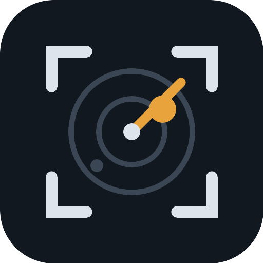

<div align="center">
  
  <h1>awscan</h1>
  <p>Automated web vulnerability scanner untuk security testing yang berwenang.<br>
  Tanpa dependency. Python 3.9+, cukup standard library.</p>
  <p>
    <a href="https://github.com/0xgetz/awscan/releases"></a>
    <a href="LICENSE"></a>
    
    
  </p>
  <p>
    <a href="README.md">English</a> · Bahasa Indonesia · <a href="README.zh-CN.md">中文</a> · <a href="README.ja.md">日本語</a> · <a href="README.ko.md">한국어</a>
  </p>
</div>

## Pengertian

awscan menjalankan rangkaian pengecekan injection, kebocoran informasi, dan salah konfigurasi yang sudah terbukti ke sebuah target, lalu melaporkan setiap temuan beserta vektor request persisnya supaya bisa lo reproduksi manual. Alat ini dibangun di atas dua disiplin yang biasanya dilewati tool sejenis:

1. **Gerbang scope keras.** Scanner menolak mengirim satu request pun ke host yang tidak ada di file scope lo. Tidak ada flag yang bisa menembusnya; crawler memeriksa ulang gerbang ini sebelum setiap hop.
2. **Model keyakinan.** Selisih panjang byte mentah tidak pernah dihitung sebagai temuan. Klaim injection butuh error marker DBMS atau diferensial TRUE/FALSE di anchor yang stabil. Hasil timing selalu ditandai untuk pengecekan manual karena jitter bisa memalsukannya.

Laporan keluar sebagai JSON, Markdown, dan SARIF 2.1.0. File SARIF bisa langsung diimpor ke GitHub Security tab, VS Code, atau DefectDojo, lengkap dengan pemetaan CWE per temuan.

## Daftar pengecekan

| Area | Teknik |
|---|---|
| Crawl same-origin | BFS lewat link, form, dan JS bundle untuk menemukan halaman plus semua parameter GET; path 401/403 dikumpulkan untuk baterai bypass |
| SQL injection | Sniff error marker DBMS plus oracle diferensial TRUE/FALSE pada anchor state yang stabil |
| Ekstraksi boolean-blind | Pemulihan karakter demi karakter lewat oracle yang terkonfirmasi, pakai kesetaraan `substr()` portabel (bentuk SQLite, MySQL, PostgreSQL) |
| Blind SQLi time-based | Payload stacked-delay (MySQL `SLEEP`, PostgreSQL `pg_sleep`, MSSQL `WAITFOR`) diukur terhadap latency median baseline |
| Reflected XSS | Refleksi byte-identical dari probe unik dengan kutip tak-ter-encode, lalu konfirmasi payload event-handler |
| SSTI | Probe template aritmatika (kelas `{{7*7}}`, `${...}`, ERB, Freemarker); HIT butuh probe kembali dalam keadaan terhitung, bukan ter-echo |
| Open redirect | Ganti parameter ke host canary eksternal, diverifikasi lewat header `Location` |
| Host header injection | Header `Host:` canary yang memantul di body atau link; kelas password-reset poisoning |
| Bypass 403/401 | Trik path (`;/`, `..;`, `%2e`, double-slash) plus trik header (`X-Forwarded-For`, `X-Original-URL`, `X-Rewrite-URL`) ke semua path forbidden yang ditemukan |
| GraphQL | Probe introspeksi `__schema` read-only di endpoint umum |
| Secret di JS | Sweep bundle yang di-crawl untuk pola AWS, GCP, GitHub, Stripe, JWT, private-key; nilai di-mask di laporan, tidak pernah ditulis utuh |
| Header & cookie | CSP, X-Frame-Options, HSTS, XCTO, Referrer-Policy, Permissions-Policy yang hilang; audit HttpOnly/Secure/SameSite cookie; disclosure versi server |
| Path terekspos | Path sensitif konvensional (`.env`, `.git/HEAD`, backup) dengan konfirmasi sadar-konten |
| Fingerprint WAF/CDN | Analisis pasif header dan respons payload jinak (Cloudflare, AWS WAF, Akamai, mod_security, Imperva); informatif, memberi tahu strategi encoding mana yang harus dipakai |

## Prasyarat

- Python 3.9 atau lebih baru, tanpa paket pihak ketiga
- Izin tertulis untuk setiap target yang lo arahkan

## Instalasi

```bash
# dari GitHub (pipx, uv, atau pip sama-sama jalan)
pipx install git+https://github.com/0xgetz/awscan.git
# atau jalankan langsung dari clone, tanpa langkah instal
git clone https://github.com/0xgetz/awscan && cd awscan
python3 -m awscan.cli --help
```

## Gerbang scope

```
$ awscan --target https://situs-orang-lain.example/x?q=TEST --scope scope-saya.txt
[!] host 'situs-orang-lain.example' TIDAK ada di file scope. Menolak mengirim request apa pun.
```

Tambahkan host hanya kalau lo pegang otorisasi: scope resmi program bug bounty, aset lo sendiri, atau lab. File contoh sengaja terisi entri loopback saja.

## Mulai cepat

```bash
cp scope.example.txt scope-saya.txt   # edit: tambahkan host yang berwenang

# 1) Uji-mandiri terhadap lab bawaan yang disengaja rentan (khusus loopback)
python3 lab_server.py --port 8777 &
awscan --crawl --root http://127.0.0.1:8777 --scope scope-saya.txt --delay 0.05
# → 10 temuan di lab: SQLi (termasuk secret hasil blind-extraction), SSTI, XSS,
#   open redirect, host-header injection, /admin yang Jebol, GraphQL, secret di JS,
#   path terekspos, kebersihan header

# 2) Satu surface manual dengan sesi login plus demo ekstraksi blind
awscan --target "http://127.0.0.1:8777/search?q=TEST" --scope scope-saya.txt \
  --delay 0.05 --extract-sql "SELECT secret FROM secrets LIMIT 1"

# 3) Target produksi yang berwenang (pertahankan default yang sopan: delay >= 1s)
awscan --crawl --root https://in-scope.example.com --scope scope-saya.txt \
  --header "Cookie: session=<punya-lo>"
```

Di URL `--target` manual, `TEST` adalah placeholder injeksi yang ditukar scanner per payload. Dengan `--crawl` lo tidak butuh placeholder sama sekali.

## Opsi

| Flag | Default | Arti |
|---|---|---|
| `--target` | (wajib kecuali crawl) | URL dengan nilai param placeholder `TEST` |
| `--crawl` | mati | Crawl same-origin yang menemukan surface injeksi otomatis |
| `--root` | dari target | URL seed crawl |
| `--max-pages` | 60 | Batas halaman crawl |
| `--scope` | `scope.example.txt` | File host berwenang; `*.domain` cocok dengan subdomain |
| `--delay` | 1.0 | Detik antar request (pertahankan >= 1 di produksi) |
| `--budget` | 900 | Detik wall-clock sebelum keluar paksa; pagar yang tidak bisa di-lewati socket yang nyangkut |
| `--header` | tidak ada | Header custom repeatable, misal `--header "Cookie: sid=abc"` |
| `--extract-sql` | mati | Demo ekstraksi boolean-blind dari satu ekspresi SELECT |
| `--out` | `reports` | Direktori output JSON, Markdown, dan SARIF |

## Development

```bash
python3 -m unittest discover -s test   # 27 tes, sepenuhnya offline
```

Suitenya menyalakan lab loopback di port ephemeral untuk setiap kasus; tidak ada yang menyentuh jaringan. Aturan yang menjaga alat ini tetap layak dipercaya tertulis di [CONTRIBUTING.md](CONTRIBUTING.md).

## Penggunaan bertanggung jawab

- Hanya target berwenang. Gerbang scope ada supaya jalur jujur jadi jalur termudah.
- Temuan adalah kandidat. Validasi manual satu per satu sebelum melapor atau memperbaiki.
- `lab_server.py` sengaja tidak aman dan khusus loopback. Jangan pernah mengeksposnya.

## Lisensi

MIT. Lihat [LICENSE](LICENSE).
